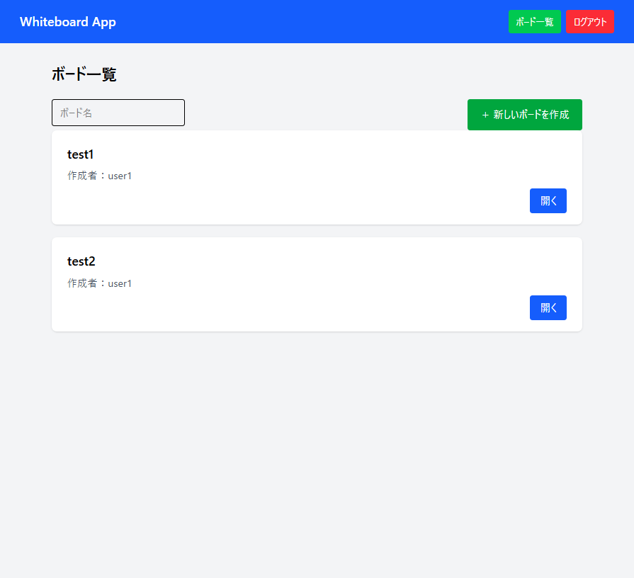
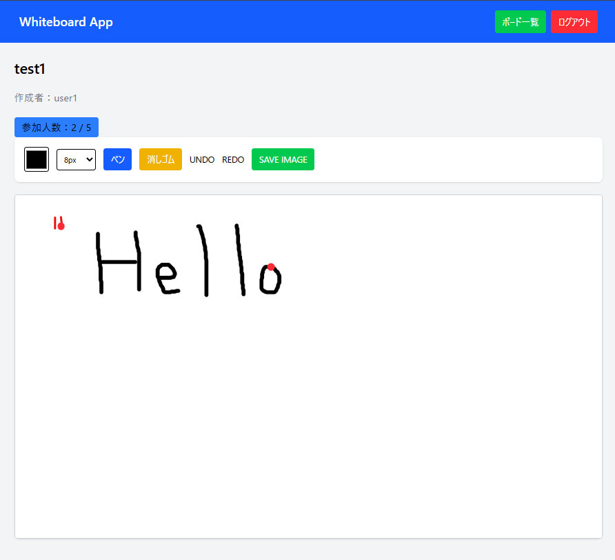
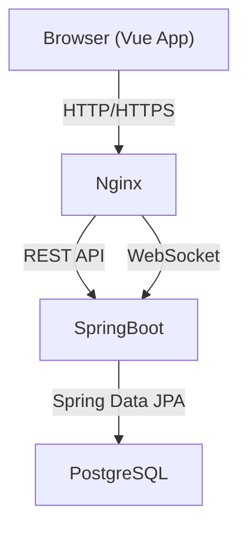
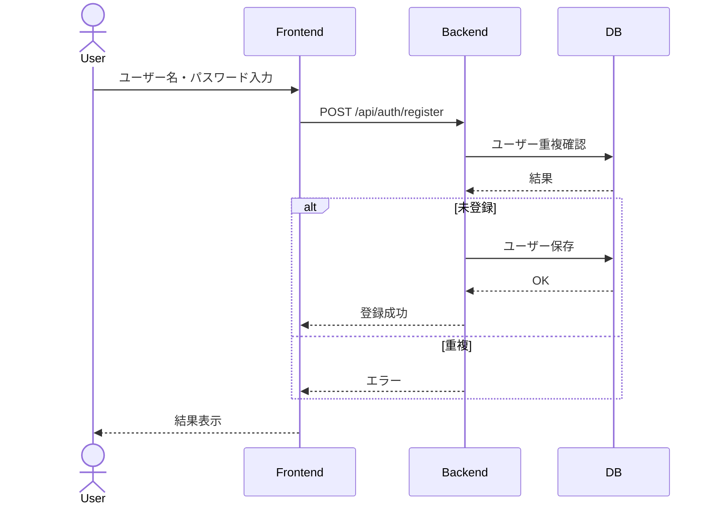
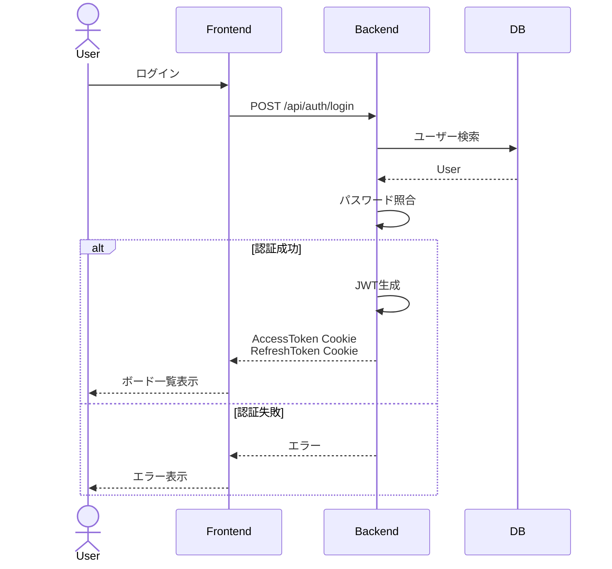
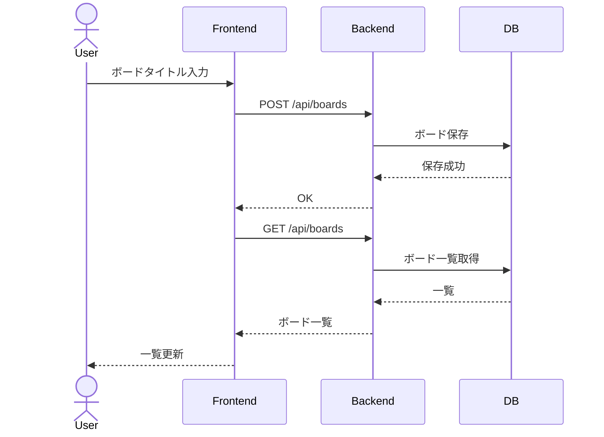
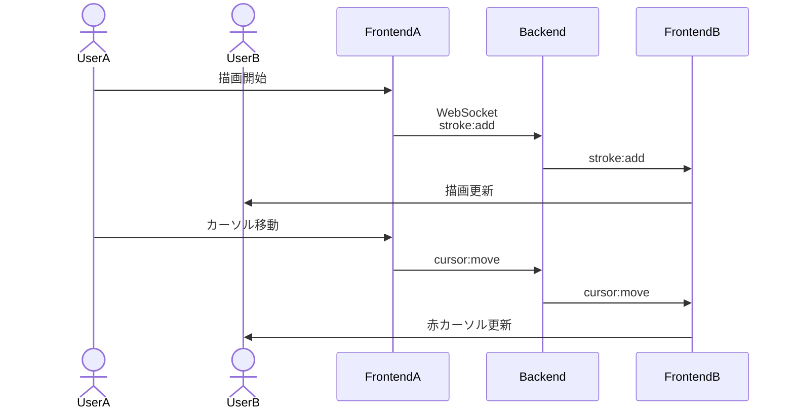
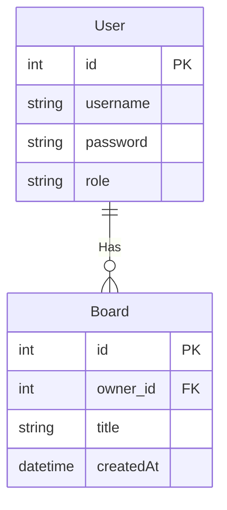

# Whiteboard App

## 概要

複数ユーザーが同じホワイトボードへリアルタイムで描画できるWebアプリケーションです。

JWT認証によるログイン機能を実装し、WebSocketを利用したリアルタイム描画・カーソル共有・Undo/Redoに対応しています。また、管理者画面ではユーザーやボードの管理を行うことができます。

### 主な機能

| 機能        | 内容           |
| --------- | ------------ |
| ユーザー登録    | ユーザー作成       |
| ログイン      | JWT Cookie認証 |
| ログアウト     | Cookie削除     |
| ボード作成     | タイトル指定       |
| ボード一覧     | 参加可能         |
| 描画        | Canvas       |
| リアルタイム同期  | WebSocket    |
| カーソル共有    | リアルタイム表示     |
| Undo/Redo | 描画履歴         |
| 消しゴム      | 部分削除         |
| 保存      | イメージ保存         |
| 管理者画面     | ユーザー管理・ボード管理 |

### 認証仕様

- 認証方式：JWT（HttpOnly Cookie）
- AccessToken有効期限：1時間
- RefreshTokenによる再発行対応

※JWT_SECRETは、docker-compose.ymlで設定

### 制約

- WebSocket同時接続数：最大5ユーザー（アプリケーション全体）

### 画面イメージ

### ボード一覧



### ホワイトボード描画



## 環境構築
```bash
git clone <repository>
cd bord-app-form

docker compose up --build
```

## DBリセット
```bash
docker compose down -v
docker compose up --build 
``` 

## 開発環境

トップ画面:http://localhost:5173

※アプリ起動時に管理者ユーザーが自動作成されます。
- ユーザー名：admin
- パスワード：Initializerで設定した値

## 使用技術

| 分類        | 技術              |
| --------- | --------------- |
| Frontend  | Vue 3           |
| Build     | Vite            |
| Language  | TypeScript      |
| CSS       | TailwindCSS     |
| Backend   | Spring Boot     |
| Language  | Java 21         |
| Security  | Spring Security |
| Auth      | JWT             |
| DB        | PostgreSQL 16   |
| ORM       | Spring Data JPA |
| Realtime  | WebSocket       |
| Container | Docker Compose  |


## システム構成図


## シーケンス図

###　ユーザー登録



### ログイン



### ボード作成



### リアルタイム描画



## ER図


## API

### 認証 API

| Method | Endpoint | 説明 | 認証 |
|---|---|---|---|
| POST | /api/auth/register | ユーザー登録 | 不要 |
| POST | /api/auth/login | ログイン（JWT Cookie発行） | 不要 |
| POST | /api/auth/logout | ログアウト（Cookie削除） | 不要 |
| POST | /api/auth/refresh | AccessToken再発行 | 不要 |
| GET | /api/me | ログインユーザー情報取得 | 必要 |


### Board API

| Method | Endpoint | 説明 | 認証 |
|---|---|---|---|
| POST | /api/boards | ボード作成 | 必要 |
| GET | /api/boards | ボード一覧取得 | 必要 |
| GET | /api/boards/{id} | ボード詳細取得 | 必要 |


### Admin API

| Method | Endpoint | 説明 | 認証 |
|---|---|---|---|
| GET | /api/admin/users | ユーザー一覧 | ADMIN |
| DELETE | /api/admin/users/{id} | ユーザー削除 | ADMIN |
| GET | /api/admin/boards | ボード一覧 | ADMIN |
| DELETE | /api/admin/boards/{id} | ボード削除 | ADMIN |


### WebSocket

| Endpoint | 説明 |
|---|---|
| /ws/board?boardId={id} | リアルタイム描画通信 |

### Swagger UI

Swagger UI を利用して API の仕様を確認できます。

- ローカル環境

  - http://localhost:8080/swagger-ui/index.html

- EC2環境

  - http://<サーバーIP>/swagger-ui/index.html

## CI/CD

本アプリでは、GitHub Actionsを利用してCI/CDパイプラインを構築しています。

### CI（Continuous Integration）

`main`ブランチへのpushまたはPull Requestをトリガーに、自動でバックエンドのテストを実行します。

使用技術：

* GitHub Actions
* Java 21
* Gradle
* JUnit

処理内容：

1. GitHub Actions起動
2. ソースコード取得
3. Java 21環境構築
4. Gradleキャッシュ利用
5. Spring Bootバックエンドのテスト実行

```bash
./gradlew test
```

テストが成功した場合のみ、CD処理へ進みます。

---

### CD（Continuous Deployment）

CI成功後、GitHub ActionsからAWS Systems Manager（SSM）を利用してEC2へ自動デプロイします。

デプロイフロー：

```
git push main
      |
      v
GitHub Actions
      |
      v
Backend Test
      |
      | success
      v
Deploy to EC2
      |
      v
AWS Systems Manager
      |
      v
EC2
      |
      v
Docker Compose更新
```

---

#### デプロイ処理

EC2上では以下の処理を自動実行します。

```bash
git fetch origin main
git reset --hard origin/main

docker compose -f docker-compose.prod.yml down

docker compose -f docker-compose.prod.yml build backend
docker compose -f docker-compose.prod.yml build frontend

docker compose -f docker-compose.prod.yml up -d
```

---

#### AWS構成

デプロイにはAWS Systems Manager Session Managerを利用しています。

構成：

```
GitHub Actions
      |
      | AWS API
      |
      v
Systems Manager
      |
      v
EC2
```

SSHによる直接接続ではなく、SSM経由でEC2操作を行うことで、SSHポートを外部公開せずにデプロイできます。

---

#### 利用サービス

| サービス                | 用途           |
| ------------------- | ------------ |
| GitHub Actions      | CI/CDパイプライン  |
| AWS Systems Manager | EC2へのリモート実行  |
| Amazon EC2          | アプリケーション実行環境 |
| Docker Compose      | コンテナ管理       |

---

#### デプロイ運用

* GitHubのmainブランチを正として管理
* EC2側で直接コード変更は行わない
* デプロイ時にGitHubの最新状態へ同期
* テスト成功後のみ本番環境へ反映

これにより、コード変更から本番環境反映までを自動化しています。

## WebSocket 負荷試験

### 使用ツール

* k6

### 試験内容

WebSocketの接続制御およびリアルタイム描画イベントの配信負荷を確認。

実施内容:

* WebSocket同時接続数: 最大5ユーザー
* 接続数上限(MAX_CONNECTIONS=5)の動作確認
* 描画イベント(`stroke:add`)の送信負荷確認
* 1ユーザーあたり10 stroke/sec（合計約50 stroke/sec）

### 実行方法
事前にK6インストールをしてください。

1. k6ディレクトリへ移動

```bash
cd k6
```

2. WebSocket接続数試験
```bash
k6 run websocket-test.js
```

3. 描画イベント配信負荷試験
```bash
k6 run websocket-stroke-test.js
```

### 結果

* 最大5 WebSocket接続が正常に動作することを確認
* 接続上限を超えた場合の切断処理が正常に動作することを確認
* stroke:addイベントのbroadcast処理が正常に動作することを確認
* 負荷試験中のCPU・メモリ使用量を確認し、リソース不足につながる兆候がないことを確認

### リソース確認

`docker stats`で負荷試験中のコンテナリソースを確認。

* Backend(Spring Boot)

  * Memory: 安定して推移し、メモリリークと思われる増加は確認されなかった
  * CPU: 一時的な上昇はあるが継続的な高負荷なし

* PostgreSQL

  * 大きな負荷は発生なし

### 結論

5ユーザーによるリアルタイム共同編集を想定した負荷試験を実施し、WebSocket接続管理および描画イベント配信が正常に動作することを確認した。
